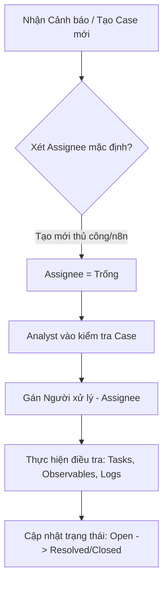
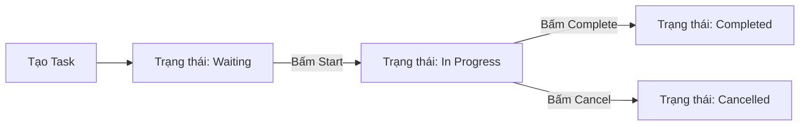
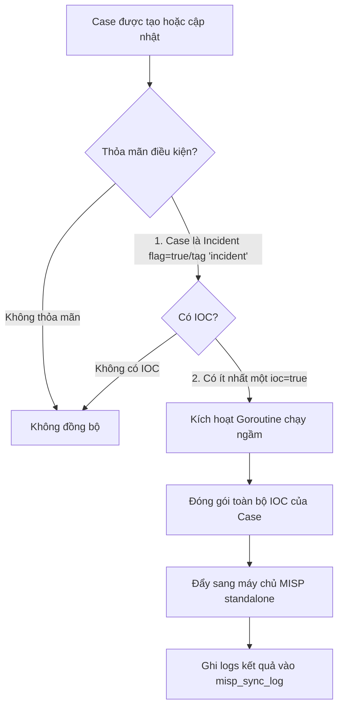

# TÀI LIỆU HƯỚNG DẪN SỬ DỤNG: NỀN TẢNG NCS FUSION CENTER
> **Dành cho**: Đội ngũ Quản lý, SOC Analyst, và Đội ngũ Tự động hóa (n8n Developers).  
> **Nền tảng**: NCS Fusion Center (Hệ thống quản lý sự cố và chia sẻ thông tin tình báo an ninh mạng - Phiên bản nâng cấp toàn diện từ TheHive4).

Tài liệu này cung cấp hướng dẫn sử dụng chi tiết, phân tích logic luồng nghiệp vụ trên giao diện UI/UX và danh mục đầy đủ các API Endpoint tương ứng của nền tảng **NCS Fusion Center**.

---

## MỤC LỤC
1. [GIỚI THIỆU CHUNG & KHỞI CHẠY HỆ THỐNG](#1-gioi-thieu-chung--khoi-chay-he-thong)
2. [LOGIC LUỒNG QUẢN LÝ SỰ CỐ (CASE MANAGEMENT)](#2-logic-luong-quan-ly-su-co-case-management)
3. [LOGIC LUỒNG QUẢN LÝ CÔNG VIỆC (TASK MANAGEMENT)](#3-logic-luong-quan-ly-cong-viec-task-management)
4. [LOGIC LUỒNG QUẢN LÝ CHỈ SỐ KỸ THUẬT (OBSERVABLES & IOCS)](#4-logic-luong-quan-ly-chi-so-ky-thuat-observables--iocs)
5. [CƠ CHẾ ĐỒNG BỘ TỰ ĐỘNG & THỦ CÔNG SANG MISP](#5-co-che-dong-bo-tu-dong--thu-cong-sang-misp)
6. [HỆ THỐNG CẢNH BÁO SỰ CỐ THÔ (ALERTS MANAGEMENT)](#6-he-thong-canh-bao-su-co-tho-alerts-management)
7. [TÍCH HỢP TỰ ĐỘNG HÓA QUA HỆ THỐNG API CHO n8n](#7-tich-hop-tu-dong-hoa-qua-he-thong-api-cho-n8n)
8. [QUẢN LÝ HỆ THỐNG & THIẾT LẬP CẤU HÌNH (SYSTEM SETTINGS)](#8-quan-ly-he-thong--thiet-lap-cau-hinh-system-settings)

---

## 1. GIỚI THIỆU CHUNG & KHỞI CHẠY HỆ THỐNG

### 1.1 Tổng Quan Nền Tảng
**NCS Fusion Center** là giải pháp trung tâm điều hành ứng phó sự cố an ninh mạng thế hệ mới. Hệ thống được phát triển nhằm mục đích hợp nhất quy trình phân tích sự cố bảo mật (Case Management), điều phối nhân sự SOC (Task Management), trích xuất và phân tích chỉ số kỹ thuật độc hại (Observables/IOCs) và chia sẻ thông tin tình báo độc hại theo thời gian thực tới các máy chủ MISP (Malware Information Sharing Platform) độc lập.

### 1.2 Khởi Chạy Bằng Docker-Compose
Toàn bộ dự án đã được đóng gói tối ưu. Để khởi chạy toàn bộ hệ thống (bao gồm Backend Go, Frontend Next.js, Cơ sở dữ liệu Postgres, Redis, và máy chủ MISP Standalone), bạn chỉ cần mở Terminal tại thư mục gốc của dự án và chạy **duy nhất một lệnh**:

```bash
docker-compose up -d --build
```

Hệ thống sẽ tự động khởi tạo các container, thiết lập môi trường mạng (network), cấu trúc cơ sở dữ liệu (migration), và mở các cổng dịch vụ sẵn sàng để truy cập:
- **Frontend UI**: `http://localhost:3000`
- **Backend API**: `http://localhost:8080`

---

## 2. LOGIC LUỒNG QUẢN LÝ SỰ CỐ (CASE MANAGEMENT)

Quản lý Sự cố (Case) là trục xương sống của hệ thống NCS Fusion Center. Mọi hoạt động điều tra, ứng phó của Analyst đều xoay quanh một Case cụ thể.



### 2.1 Hướng Dẫn Sử Dụng Trên Giao Diện UI/UX

#### A. Màn hình danh sách Case (`/cases`)
- **Giao diện**: Hiển thị danh sách các sự cố dưới dạng bảng hiện đại, hỗ trợ phân trang và tìm kiếm nhanh.
- **Các chỉ số hiển thị**: 
  - **Mã số (Number)**: Định danh số tăng dần của case (Ví dụ: `#1042`).
  - **Độ nghiêm trọng (Severity)**: Phân mức màu sắc trực quan (Critical - Đỏ, High - Cam, Medium - Vàng, Low - Xanh lá).
  - **TLP (Traffic Light Protocol)**: Phân loại mức độ chia sẻ thông tin (Red, Amber, Green, White).
  - **PAP (Permissible Actions Protocol)**: Phân loại giới hạn hành động được phép (Red, Amber, Green, White).
  - **Người xử lý (Assignee)**: Hiển thị tên Analyst đang xử lý.
  - **Trạng thái (Status)**: Badge trạng thái sinh động (`Open`, `Resolved`, `Closed`).
  - **Nhãn (Tags)**: Danh sách thẻ phân loại sự cố.
- **Bộ lọc động (Filters)**: Cho phép lọc nhanh theo Trạng thái, Độ nghiêm trọng, Người xử lý hoặc tìm kiếm từ khóa theo Tiêu đề/Mô tả.

#### B. Tạo mới Case thủ công
- Nhấp chọn nút **New Case** ở góc trên bên phải màn hình danh sách.
- Nhập các thông tin bắt buộc: *Tiêu đề (Title)*, *Mô tả (Description)*, chọn *Độ nghiêm trọng (Severity)*, *TLP*, *PAP*.
- Nhập danh sách *Thẻ (Tags)* để dễ phân loại (Ví dụ: `malware`, `phishing`, `phong-toa`).
- **Lưu ý đặc biệt (Logic Assignee)**: Theo thiết kế mặc định của hệ thống, khi tạo mới một Case, trường **Người xử lý (Assignee)** sẽ được để **TRỐNG (unassigned)**. Điều này giúp tránh việc gán nhầm người khi chưa đánh giá mức độ sự cố. Trưởng nhóm SOC hoặc các Analyst sẽ tự vào kiểm tra danh sách Case chưa gán, đánh giá độ ưu tiên và tự nhận xử lý (bằng cách chọn tên mình trong dropdown Assignee) hoặc gán cho thành viên khác phù hợp.

#### C. Chi tiết Case (`/cases/[id]`)
- Khi nhấp chọn một Case từ danh sách, giao diện sẽ chuyển hướng vào trang quản lý chi tiết Case.
- **Sidebar thông tin**: Ở phần khung thông tin chi tiết (bên trái/bên phải), Analyst có thể cập nhật nhanh các thuộc tính của Case như Độ nghiêm trọng, TLP, PAP, Trạng thái (Open/Resolved/Closed), và đặc biệt là chọn/đổi **Assignee** thông qua dropdown mượt mà.
- **Khu vực làm việc chính (Tabs)**:
  - **Tasks**: Nơi quản lý danh sách công việc điều tra.
  - **Observables**: Nơi quản lý các chỉ số kỹ thuật độc hại (IOC) và kích hoạt đồng bộ MISP.
  - **Logs**: Nơi Analyst lưu trữ các ghi chú tiến trình, phân tích kỹ thuật dạng văn bản Markdown.
  - **Timeline**: Nhật ký hệ thống tự động ghi nhận mọi thao tác (Ví dụ: *"Analyst A đã thay đổi độ nghiêm trọng từ Low lên High lúc 14:30"*).

---

### 2.2 Chi Tiết Các API Endpoints Tương Ứng

Tất cả các API này yêu cầu xác thực qua Bearer Token JWT thông thường của Analyst và quyền `manageCase`.

#### 1. Lấy danh sách các Case
- **Đường dẫn**: `GET /api/v1/cases`
- **Tham số truy vấn (Query Params)**:
  - `status` (tùy chọn): Lọc theo trạng thái (Ví dụ: `Open`, `Resolved`).
  - `severity` (tùy chọn): Lọc theo độ nghiêm trọng (1: Low, 2: Medium, 3: High, 4: Critical).
  - `assignee` (tùy chọn): Lọc theo người xử lý.
- **Phản hồi mẫu (HTTP 200 OK)**:
```json
[
  {
    "id": "e0a29582-cf8b-4b10-a931-c0ef41ab8b91",
    "number": 101,
    "title": "Phát hiện mã độc Ransomware trên máy chủ Web",
    "description": "Hệ thống giám sát phát hiện file thực thi độc hại .exe chạy ngầm.",
    "severity": 4,
    "tlp": 3,
    "pap": 3,
    "status": "Open",
    "owner": "admin",
    "assignee": "",
    "tags": ["ransomware", "incident", "server-critical"],
    "flag": true,
    "created_at": "2026-05-21T10:00:00Z"
  }
]
```

#### 2. Tạo mới một Case
- **Đường dẫn**: `POST /api/v1/cases`
- **Yêu cầu dữ liệu gửi lên (Request Body)**:
```json
{
  "title": "Phát hiện tấn công dò quét cổng brute-force",
  "description": "IP nguồn bên ngoài thực hiện hơn 1000 truy vấn đăng nhập sai.",
  "severity": 2,
  "tlp": 2,
  "pap": 1,
  "tags": ["brute-force", "ssh"],
  "flag": false
}
```
*Lưu ý: Không truyền tham số `assignee` để mặc định trống như yêu cầu.*
- **Phản hồi mẫu (HTTP 201 Created)**:
```json
{
  "id": "7b8e192a-bcfd-4c31-90a1-778fe8b10852",
  "number": 102,
  "title": "Phát hiện tấn công dò quét cổng brute-force",
  "status": "Open",
  "assignee": "",
  "created_at": "2026-05-21T10:05:00Z"
}
```

#### 3. Cập nhật thông tin Case (Patch)
- **Đường dẫn**: `PATCH /api/v1/cases/:id`
- **Request Body mẫu (Gán Assignee và cập nhật Tag)**:
```json
{
  "assignee": "analyst_hungdt",
  "tags": ["brute-force", "ssh", "investigating"],
  "flag": true
}
```
- **Phản hồi mẫu (HTTP 200 OK)**:
```json
{
  "id": "7b8e192a-bcfd-4c31-90a1-778fe8b10852",
  "title": "Phát hiện tấn công dò quét cổng brute-force",
  "assignee": "analyst_hungdt",
  "status": "Open",
  "flag": true,
  "tags": ["brute-force", "ssh", "investigating"]
}
```

#### 4. Đóng Case (Close)
- **Đường dẫn**: `POST /api/v1/cases/:id/close`
- **Request Body mẫu**:
```json
{
  "status": "Resolved",
  "summary": "Đã chặn IP tấn công trên Firewall, cấu hình lại giới hạn đăng nhập SSH."
}
```
- **Phản hồi mẫu (HTTP 200 OK)**:
```json
{
  "id": "7b8e192a-bcfd-4c31-90a1-778fe8b10852",
  "status": "Resolved",
  "summary": "Đã chặn IP tấn công trên Firewall, cấu hình lại giới hạn đăng nhập SSH."
}
```

---

## 3. LOGIC LUỒNG QUẢN LÝ CÔNG VIỆC (TASK MANAGEMENT)

Để giải quyết một Case phức tạp, SOC Team cần phân tách quy trình xử lý thành nhiều đầu việc (Tasks) nhỏ hơn và giao cho các thành viên phối hợp xử lý.



### 3.1 Hướng Dẫn Sử Dụng Trên Giao Diện UI/UX

#### A. Xem và Tạo mới Task
- Tại chi tiết Case, nhấp chọn tab **Tasks**.
- Giao diện sẽ hiển thị danh sách các Task hiện tại kèm Trạng thái và Người thực hiện.
- Nhấp chọn **Add Task** để tạo mới một công việc.
- Nhập *Tiêu đề (Title)* (Ví dụ: *"Trích xuất log Firewall"*), *Mô tả công việc (Description)*, và có thể gán ngay cho một Analyst thực hiện hoặc để trống.
- Bấm lưu, Task mới được tạo sẽ nằm ở trạng thái mặc định là `Waiting`.

#### B. Quy trình cập nhật trạng thái Task trực quan
- Hệ thống hỗ trợ các nút thao tác nhanh ngay trên từng dòng Task giúp Analyst không mất nhiều thao tác:
  - **Nút Start (Bắt đầu)**: Chuyển trạng thái Task từ `Waiting` sang `In Progress` (Đang thực hiện), ghi nhận thời điểm bắt đầu.
  - **Nút Complete (Hoàn thành)**: Chuyển trạng thái từ `In Progress` sang `Completed` (Đã hoàn tất), đóng gói công việc.
  - **Nút Cancel (Hủy bỏ)**: Chuyển trạng thái sang `Cancelled` (Đã hủy) nếu công việc đó không còn cần thiết.
- **Task Logs (Nhật ký thực hiện)**: Khi click vào một Task cụ thể, Analyst có thể viết nhật ký báo cáo tiến độ chi tiết (Task Logs) bằng văn bản Markdown, đính kèm file ảnh kết quả hoặc tài liệu báo cáo để lưu vết lịch sử điều tra.

---

### 3.2 Chi Tiết Các API Endpoints Tương Ứng

Yêu cầu Bearer Token JWT và quyền `manageTask`.

#### 1. Tạo mới Task cho Case
- **Đường dẫn**: `POST /api/v1/tasks`
- **Request Body mẫu**:
```json
{
  "case_id": "7b8e192a-bcfd-4c31-90a1-778fe8b10852",
  "title": "Phân tích file mã độc thu thập được",
  "description": "Chạy phân tích tĩnh và động file malware.exe trong môi trường Sandbox.",
  "assignee": "analyst_tung",
  "status": "Waiting"
}
```
- **Phản hồi mẫu (HTTP 201 Created)**:
```json
{
  "id": "9a1e828f-b98a-48d6-ac11-399fa51890ef",
  "case_id": "7b8e192a-bcfd-4c31-90a1-778fe8b10852",
  "title": "Phân tích file mã độc thu thập được",
  "status": "Waiting",
  "assignee": "analyst_tung"
}
```

#### 2. Kích hoạt bắt đầu thực hiện Task (Start Task)
- **Đường dẫn**: `POST /api/v1/tasks/:id/start`
- **Phản hồi mẫu (HTTP 200 OK)**:
```json
{
  "id": "9a1e828f-b98a-48d6-ac11-399fa51890ef",
  "status": "InProgress",
  "start_date": "2026-05-21T10:15:30Z"
}
```

#### 3. Hoàn thành Task (Close Task)
- **Đường dẫn**: `POST /api/v1/tasks/:id/close`
- **Phản hồi mẫu (HTTP 200 OK)**:
```json
{
  "id": "9a1e828f-b98a-48d6-ac11-399fa51890ef",
  "status": "Completed",
  "end_date": "2026-05-21T10:45:00Z"
}
```

#### 4. Thêm ghi chú/nhật ký công việc (Task Log)
- **Đường dẫn**: `POST /api/v1/tasks/:id/logs`
- **Request Body mẫu**:
```json
{
  "message": "Kết quả phân tích Sandbox: File thực thi cố gắng kết nối tới domain độc hại `evil-domain-phishing.com` qua cổng 8080."
}
```
- **Phản hồi mẫu (HTTP 201 Created)**:
```json
{
  "id": "c7a8b192-39fe-40af-a823-118f9c1827fa",
  "task_id": "9a1e828f-b98a-48d6-ac11-399fa51890ef",
  "message": "Kết quả phân tích Sandbox: File thực thi cố gắng kết nối tới domain độc hại `evil-domain-phishing.com` qua cổng 8080.",
  "created_at": "2026-05-21T10:40:00Z"
}
```

---

## 4. LOGIC LUỒNG QUẢN LÝ CHỈ SỐ KỸ THUẬT (OBSERVABLES & IOCS)

Observable là bất kỳ thông tin kỹ thuật nào thu thập được trong quá trình điều tra (Địa chỉ IP, Domain, Tên tệp tin, Mã Hash, Email, URL,...). Khi một Observable được xác định là độc hại và đe dọa hệ thống, nó sẽ được gắn cờ là **IOC (Indicator of Compromise)**.

### 4.1 Hướng Dẫn Sử Dụng Trên Giao Diện UI/UX

#### A. Thêm mới Observables
- Tại chi tiết Case, nhấp chọn tab **Observables**.
- Bấm nút **New observable(s)** để mở hộp thoại thêm mới.
- Hộp thoại hỗ trợ nhập hàng loạt vô cùng tiện lợi:
  - **Type**: Chọn kiểu chỉ số (Ví dụ: `ip`, `domain`, `hash`).
  - **Value**: Có thể nhập một hoặc nhiều giá trị (mỗi giá trị trên một dòng).
  - **Is IOC**: Tích chọn checkbox này nếu xác định đây là chỉ số độc hại cần được đánh dấu đặc biệt và chia sẻ.
  - **Description**: Mô tả nguồn gốc thu thập chỉ số.
  - **Tags**: Thêm các nhãn định danh (Ví dụ: `c2`, `phishing`).

#### B. Phân biệt IOC trực quan trên UI
- Các Observables được đánh dấu `Is IOC = true` sẽ hiển thị một **Badge màu đỏ rực rỡ "IOC"** kế bên giá trị của nó trong bảng danh sách, giúp Analyst lập tức nhận diện được các mối đe dọa trọng tâm trong toàn bộ hàng trăm chỉ số kỹ thuật khác.
- Chi tiết Observable: Analyst có thể nhấp chọn từng dòng Observable để xem phân tích chi tiết, lịch sử tương tác, và nút đồng bộ thủ công.

---

### 4.2 Chi Tiết Các API Endpoints Tương Ứng

Yêu cầu Bearer Token JWT và quyền `manageObservable`.

#### 1. Thêm mới Observable vào một Case
- **Đường dẫn**: `POST /api/v1/observables`
- **Request Body mẫu**:
```json
{
  "case_id": "7b8e192a-bcfd-4c31-90a1-778fe8b10852",
  "data_type": "ip",
  "data": "103.28.12.94",
  "ioc": true,
  "message": "IP máy chủ điều khiển C2 của kẻ tấn công",
  "tags": ["attacker", "c2-server"]
}
```
- **Phản hồi mẫu (HTTP 201 Created)**:
```json
{
  "id": "fa89cb01-d85c-4d56-b09e-711fa21932a3",
  "case_id": "7b8e192a-bcfd-4c31-90a1-778fe8b10852",
  "data_type": "ip",
  "data": "103.28.12.94",
  "ioc": true,
  "message": "IP máy chủ điều khiển C2 của kẻ tấn công"
}
```

#### 2. Cập nhật trạng thái Observable (Thay đổi cờ IOC hoặc Tags)
- **Đường dẫn**: `PATCH /api/v1/observables/:id`
- **Request Body mẫu**:
```json
{
  "ioc": false,
  "message": "Sau khi điều tra kỹ, đây là IP CDN hợp pháp của Cloudflare",
  "tags": ["whitelist", "cdn"]
}
```
- **Phản hồi mẫu (HTTP 200 OK)**:
```json
{
  "id": "fa89cb01-d85c-4d56-b09e-711fa21932a3",
  "ioc": false,
  "message": "Sau khi điều tra kỹ, đây là IP CDN hợp pháp của Cloudflare",
  "tags": ["whitelist", "cdn"]
}
```

---

## 5. CƠ CHẾ ĐỒNG BỘ TỰ ĐỘNG & THỦ CÔNG SANG MISP

Sự kết hợp giữa **NCS Fusion Center** và máy chủ **MISP** giúp tự động hóa quy trình chia sẻ tri thức về mối đe dọa (Threat Intelligence sharing), phục vụ phòng thủ chủ động.



### 5.1 Nguyên Lý & Điều Kiện Kích Hoạt Tự Động (Auto-Sync)
Hệ thống chạy ngầm thông qua Goroutine tự động kích hoạt đồng bộ khi thỏa mãn **đồng thời 2 điều kiện**:
1. **Case thuộc loại Sự cố (Incident)**:
   - Thuộc tính Khẩn cấp `flag` của Case được bật là `true`.
   - **Hoặc** Case chứa ít nhất một Thẻ (Tag) có nội dung chứa chữ `"incident"`, `"sự cố"`, hoặc `"su co"` (Không phân biệt chữ hoa, chữ thường. Ví dụ: `Incident`, `incident`, `sự cố`, `SỰ CỐ`, `su co`).
2. **Case có chứa dữ liệu độc hại (IOC)**:
   - Có ít nhất một Observable trong Case có thuộc tính **IOC** (`ioc = true`).

### 5.2 Hướng Dẫn Điều Khiển Thủ Công (Manual Trigger) Trên UI/UX

Trong trường hợp Case chưa đủ điều kiện tự động hoặc Analyst muốn kiểm soát việc chia sẻ thông tin an toàn một cách thủ công, hệ thống hỗ trợ 2 nút trigger trực quan cực kỳ mạnh mẽ:

#### A. Đồng bộ thủ công từ Tab Observables của Case
1. Truy cập trang chi tiết Case, chuyển sang tab **Observables**.
2. Nhấp chọn nút **Đồng bộ MISP** (màu xanh lá, có biểu tượng đám mây xoay chiều) nằm kế bên nút *New observable(s)*.
3. Khi click, hệ thống backend sẽ nhận lệnh kích hoạt luồng đồng bộ ngầm ngay lập tức.
4. Một hộp thoại thông báo màu xanh dương dịu sẽ xuất hiện: *"Đã kích hoạt đồng bộ hóa IOC sang MISP trong nền thành công!"*.

#### B. Đồng bộ thủ công từ Sidebar chi tiết Observable
1. Nhấp chọn một Observable cụ thể từ danh sách để xem chi tiết.
2. Tại bảng điều khiển bên phải (**Flags & tags**), Analyst nhấp vào nút **Đồng bộ MISP** (nút màu xanh dương đậm có nhãn `Manual` rất thẩm mỹ).
3. Sau khi bấm, icon đám mây sẽ xoay thể hiện tiến trình kích hoạt.
4. Một nhãn thông báo nhanh màu xanh dương dịu sẽ hiển thị ngay dưới nút: *"Đã kích hoạt đồng bộ hóa IOC sang MISP thành công!"* và tự động biến mất sau 5 giây.

---

### 5.3 Nhật Ký Hệ Thống MISP (Sync Logs)
Mọi lượt đồng bộ (Auto hoặc Manual, thành công hay thất bại) đều được hệ thống ghi nhận chi tiết tại cơ sở dữ liệu `misp_sync_log`. 
- Giao diện quản lý cấu hình MISP tại `/misp` sẽ hiển thị lịch sử các lần đồng bộ: *Thời gian, Case ID, Trạng thái (Success/Failed), và Nội dung lỗi chi tiết* (Ví dụ: *"Failed: dial tcp 172.18.0.5:443: connect: connection refused"*). Giúp quản trị viên dễ dàng phát hiện và xử lý lỗi kết nối mạng.

---

### 5.4 API Tương Ứng (Yêu Cầu JWT Token & manageCase)
- **Đường dẫn**: `POST /api/v1/cases/:id/sync-misp`
- **Phản hồi mẫu khi kích hoạt thành công (HTTP 200 OK)**:
```json
{
  "case_id": "7b8e192a-bcfd-4c31-90a1-778fe8b10852",
  "status": "triggered",
  "message": "Đã kích hoạt đồng bộ hóa IOC sang máy chủ MISP trong nền."
}
```

---

## 6. HỆ THỐNG CẢNH BÁO SỰ CỐ THÔ (ALERTS MANAGEMENT)

Alert đại diện cho các cảnh báo an ninh thô nhận được từ các hệ thống giám sát tự động bên ngoài. Alert chưa được coi là một Case chính thức cho đến khi được Analyst thẩm định.

### 6.1 Hướng Dẫn Sử Dụng Trên Giao Diện UI/UX
- **Màn hình danh sách Cảnh báo (`/alerts`)**: Hiển thị toàn bộ các cảnh báo thô đổ về hệ thống.
- **Thẩm định và chuyển đổi**:
  - Analyst nhấp chọn một Alert đáng ngờ để xem thông tin chi tiết.
  - Bấm nút **Import to Case**: Hệ thống sẽ tự động nâng cấp Alert này thành một Case chính thức. Toàn bộ các mô tả kỹ thuật, nhãn (tags), và các tệp đính kèm của Alert sẽ được chuyển đổi mượt mà sang Case mới.
  - Bấm nút **Merge into Case**: Nếu cảnh báo này thuộc một sự cố đang điều tra sẵn có, Analyst có thể gộp Alert này vào Case đang tồn tại để tập trung dữ liệu.

---

### 6.2 Chi Tiết Các API Endpoints Tương Ứng

Yêu cầu Bearer Token JWT và quyền `manageAlert`.

#### 1. Tạo Alert mới (Dành cho các hệ thống giám sát đẩy cảnh báo về)
- **Đường dẫn**: `POST /api/v1/alerts`
- **Request Body mẫu**:
```json
{
  "source": "SIEM_Splunk",
  "sourceRef": "ALERT_REF_9812",
  "title": "Phát hiện lưu lượng truy cập bất thường ra Internet",
  "description": "Máy trạm PC_USER_01 gửi 5GB dữ liệu ra IP lạ ngoài giờ làm việc.",
  "severity": 3,
  "tlp": 2,
  "tags": ["exfiltration", "data-leak"],
  "observables": [
    {
      "data_type": "ip",
      "data": "198.51.100.45",
      "ioc": true,
      "message": "IP đích nhận dữ liệu bất thường"
    }
  ]
}
```
- **Phản hồi mẫu (HTTP 201 Created)**:
```json
{
  "id": "3be9fa01-d85c-4d56-a981-119fac182cba",
  "title": "Phát hiện lưu lượng truy cập bất thường ra Internet",
  "status": "New"
}
```

#### 2. Nâng cấp Alert thành Case (Import)
- **Đường dẫn**: `POST /api/v1/alerts/:id/import`
- **Request Body mẫu**:
```json
{
  "caseTemplate": "" 
}
```
- **Phản hồi mẫu (HTTP 200 OK)**:
```json
{
  "alertId": "3be9fa01-d85c-4d56-a981-119fac182cba",
  "caseId": "e0a29582-cf8b-4b10-a931-c0ef41ab8b91",
  "message": "Nâng cấp cảnh báo thành Case thành công!"
}
```

---

## 7. TÍCH HỢP TỰ ĐỘNG HÓA QUA HỆ THỐNG API CHO n8n

Hệ thống API dành riêng cho n8n hoặc các nền tảng SOAR bên ngoài được quy hoạch độc lập tại nhóm đường dẫn `/api/v1/n8n/*`. Nhóm API này được tối ưu hiệu năng cao và có cơ chế bảo mật rất chặt chẽ.

### 7.1 Cơ Chế Xác Thực API Key Cho n8n
Hệ thống sử dụng xác thực bằng API Key tĩnh:
- **Cách truyền API Key** (n8n chọn 1 trong 3 cách sau):
  1. Header: `X-API-Key: <your_api_key>`
  2. Header: `Authorization: Bearer <your_api_key>`
  3. Query Parameter: `?api_key=<your_api_key>`
- **Logic xác thực phía Backend**: Để đảm bảo an toàn tuyệt đối tránh rò rỉ cơ sở dữ liệu, các API Key thô **không bao giờ được lưu trực tiếp**. Backend sẽ lấy mã băm SHA-256 của API Key do n8n gửi lên, sau đó đối chiếu trực tiếp với mã băm đã lưu trong cột `key_hash` của bảng `api_keys` để nhận dạng tài khoản và nạp quyền hạn tương ứng.

---

### 7.2 Chi Tiết Các API Endpoints Dành Cho n8n

#### 1. Tạo Case Mới Kèm Các Observables/IOCs
- **Đường dẫn**: `POST /api/v1/n8n/cases`
- **Chức năng**: Tạo nhanh một Case mới đồng thời đính kèm ngay danh sách các chỉ số kỹ thuật độc hại (IOC) đi kèm chỉ bằng 1 Request duy nhất. Hệ thống sẽ tự động đồng bộ sang MISP sau khi tạo thành công nếu Case thỏa mãn điều kiện Incident.
- **Request Body mẫu (JSON)**:
```json
{
  "title": "[n8n] Phát hiện rò rỉ thông tin đăng nhập người dùng",
  "description": "Hệ thống giám sát phát hiện tài khoản admin@ncs.com.vn có hoạt động đăng nhập đáng ngờ từ dải IP lạ.",
  "severity": 3,
  "tlp": 3,
  "pap": 2,
  "flag": true,
  "tags": ["incident", "phishing", "leak"],
  "observables": [
    {
      "data_type": "ip",
      "data": "103.28.12.94",
      "ioc": true,
      "message": "IP tấn công Brute-force rò rỉ",
      "tags": ["attacker", "brute-force"]
    },
    {
      "data_type": "mail",
      "data": "admin@ncs.com.vn",
      "ioc": false,
      "message": "Tài khoản nạn nhân",
      "tags": ["victim"]
    }
  ]
}
```
- **Phản hồi mẫu (JSON - HTTP 201)**:
```json
{
  "id": "8c59bd02-c94b-4b16-bb7e-399fa51829e1",
  "number": 1042,
  "title": "[n8n] Phát hiện rò rỉ thông tin đăng nhập người dùng",
  "status": "Open",
  "observables_added": 2
}
```

#### 2. Thêm Observables/IOCs Vào Case Đang Có
- **Đường dẫn**: `POST /api/v1/n8n/cases/:id/observables`
- **Chức năng**: Thêm nhanh danh sách các chỉ số kỹ thuật độc hại (IOC) vào một Case đã có thông qua việc truyền ID Case trên URL.
- **Request Body mẫu (JSON)**:
```json
{
  "observables": [
    {
      "data_type": "domain",
      "data": "evil-domain-phishing.com",
      "ioc": true,
      "message": "Domain máy chủ C2 điều khiển độc hại",
      "tags": ["c2", "malicious"]
    }
  ]
}
```
- **Phản hồi mẫu (JSON - HTTP 200)**:
```json
{
  "case_id": "8c59bd02-c94b-4b16-bb7e-399fa51829e1",
  "observables_added": 1,
  "ids": [
    "fa89cb01-d85c-4d56-b09e-711fa21932a3"
  ]
}
```

#### 3. Ép Buộc Kích Hoạt Đồng Bộ MISP Khẩn Cấp
- **Đường dẫn**: `POST /api/v1/n8n/cases/:id/sync-misp`
- **Chức năng**: Cho phép n8n ra lệnh cưỡng chế hệ thống phải thực hiện đóng gói và đồng bộ ngay lập tức toàn bộ các IOC của Case được chỉ định sang máy chủ MISP.
- **Phản hồi mẫu (JSON - HTTP 200)**:
```json
{
  "case_id": "8c59bd02-c94b-4b16-bb7e-399fa51829e1",
  "status": "triggered",
  "message": "Đã kích hoạt đồng bộ hóa IOC sang máy chủ MISP trong nền."
}
```

#### 4. Lấy Danh Sách Các Case Sự Cố Mới Nhất
- **Đường dẫn**: `GET /api/v1/n8n/cases`
- **Chức năng**: Giúp n8n truy vấn định kỳ danh sách 50 Case mới nhất để giám sát trạng thái hoặc chạy các kịch bản tự động hóa tiếp theo.
- **Query Parameters hỗ trợ**:
  - `status`: Lọc trạng thái Case (Ví dụ: `Open`, `Resolved`).
  - `tag`: Lọc theo Thẻ cụ thể (Ví dụ: `incident`).
- **Phản hồi mẫu (JSON - HTTP 200)**:
```json
[
  {
    "id": "8c59bd02-c94b-4b16-bb7e-399fa51829e1",
    "number": 1042,
    "title": "[n8n] Phát hiện rò rỉ thông tin đăng nhập người dùng",
    "description": "Hệ thống giám sát phát hiện tài khoản admin@ncs.com.vn có hoạt động đăng nhập đáng ngờ từ dải IP lạ.",
    "severity": 3,
    "tlp": 3,
    "pap": 2,
    "status": "Open",
    "owner": "admin",
    "assignee": "",
    "tags": ["incident", "phishing", "leak"],
    "flag": true,
    "created_at": "2026-05-21T20:00:00Z"
  }
]
```

---

## 8. QUẢN LÝ HỆ THỐNG & THIẾT LẬP CẤU HÌNH (SYSTEM SETTINGS)

Dành riêng cho Quản trị viên (Admin) thiết lập nền tảng ổn định.

### 8.1 Quản Lý Người Dùng & Phân Quyền (User & RBAC)
- **Giao diện**: `/admin/users`
- **Chức năng**:
  - Quản trị viên có quyền Tạo mới tài khoản, Khóa/Mở khóa tài khoản Analyst.
  - Gán vai trò (Roles) cho từng tài khoản (Ví dụ: `admin`, `analyst`, `observer`). Mỗi vai trò sẽ được thiết lập bản đồ quyền hạn RBAC tương ứng (`manageCase`, `manageTask`, `manageObservable`, `manageAlert`,...).

### 8.2 Quản Lý API Keys Cho Tự Động Hóa (n8n API Key Setup)
- **Giao diện**: `/admin/api-keys`
- **Quy trình cấp khóa an toàn**:
  - Nhấp chọn **Generate API Key**.
  - Nhập tên nhãn gợi nhớ (Ví dụ: `n8n_SOAR_Integration`).
  - **Lưu ý**: Khóa bảo mật thô (Ví dụ: `ncs_apikey_ab12cd34...`) sẽ chỉ **hiển thị duy nhất một lần** cho bạn sao chép. Hãy lưu trữ nó cẩn thận trong n8n Credentials. Backend sẽ chỉ băm SHA-256 khóa này và lưu trữ để đối soát sau đó.

### 8.3 Cấu Hình Máy Chủ MISP
- **Giao diện**: `/misp`
- **Chức năng**:
  - Cho phép Admin nhập thông tin kết nối tới cụm máy chủ MISP standalone bao gồm: *Địa chỉ máy chủ (URL)*, *Mã khóa API kết nối (MISP Auth Key)*.
  - Bật/Tắt trạng thái hoạt động (`enabled = true/false`) của máy chủ. Khi tắt, toàn bộ cơ chế đồng bộ ngầm tự động sẽ tạm thời bỏ qua máy chủ này để tránh gây nghẽn hàng đợi.
  - Xem bảng nhật ký đồng bộ (`Sync Logs`) để theo dõi tình trạng hoạt động và kiểm tra các sự cố mất kết nối mạng.

---

> **TỔNG KẾT**:  
> Hệ thống **NCS Fusion Center** là một sự nâng cấp mang tính đột phá và chặt chẽ, tối ưu hóa toàn diện cho quy trình nghiệp vụ của Analyst từ giao diện UI/UX trực quan cho tới các luồng tích hợp tự động hóa ngầm cực kỳ an toàn và ổn định. Chúc SOC Team vận hành hệ thống hiệu quả!
